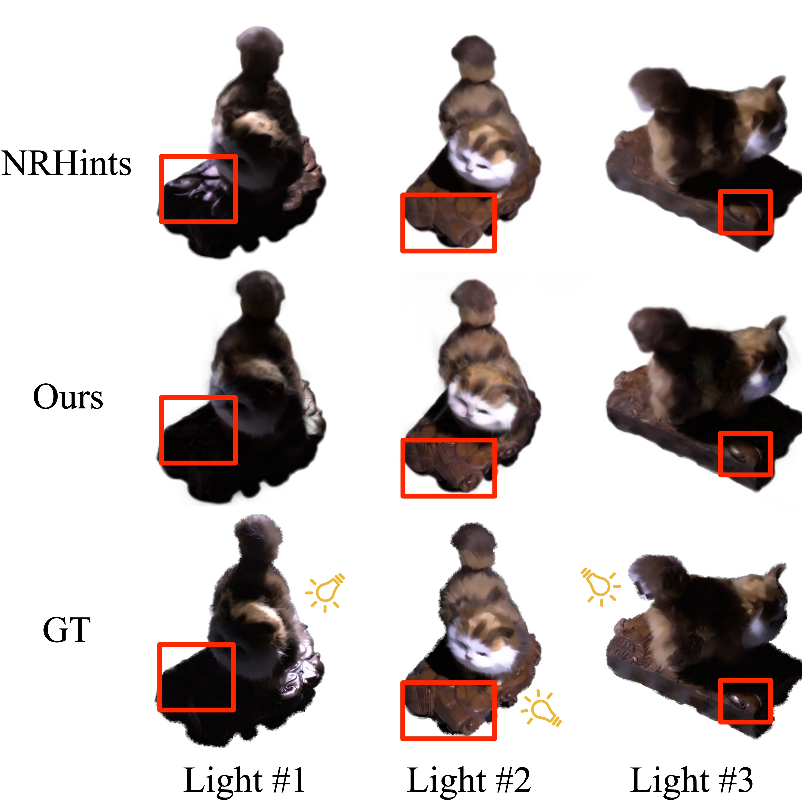

# NeurIPS_Open_Review

This repository contains tables and figures relevant to the discussion on OpenReview.

The  quantitative results of OOD scene "CatSmall" is shown as follows:

|  | PSNR | SSIM | LPIPS | 
| ---------------  | --------------- | --------------- | --------------- |
|NRHints    | 24.14    | 0.9101 | 0.1265 |
| Ours    | **25.17** | **0.9297** | **0.1135** |

The visualization of multiple testing views is shown below. As shown in the figure, NRHints fails to infer the inherent lighting logic, such as ignoring shadows (light#1) or highlights (light#3), and tends to produce over-smoothing surfaces (light#2).

We will provide the results and visualizations of other scenes as soon as they are available.
